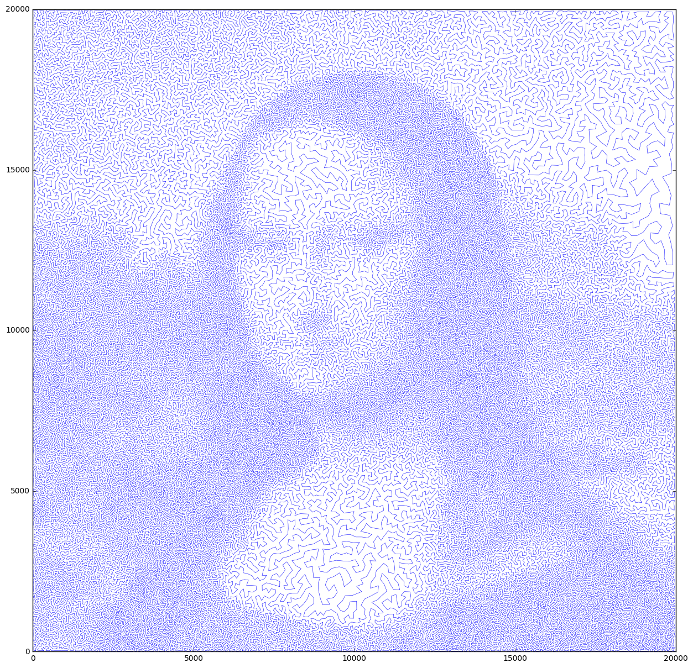

# tsp_gpu

This repository contains cuda code for solving the traveling salesman problem using a GPU. 


The purpose of this project is to use clever computational techniques to implement Metropolis Hastings algorithms on a GPU. To example the problem, we solve the traveling salesman problem using simulated annealing. The heart of implementing Metropolis Hastings on a GPU is to use the GPU to make multiple samples at each step, while checking and updating the objective and loss function in a purely parallel manner. Instead of basing updates on the best sample of a particular set of draws we simply take the last sample that was a success. This allows the update step to be made purely in parallel, with the only wait time being the write of the first success in a block.

The most useful part of a GPU implementation of Metropolis Hastings is the ability to dramatically increase the number of proposal steps made during each iteration. On a GTX 780 GPU there are 8 SM's that can handle 16 blocks of size 1024 at a time. This means we can draw and evaluate 131,072 proposal steps at each initialization of the kernel. Leveraging high throughput allows the algorithm to explore a much larger space than it would be able to search on a serial CPU. 

The code has so far only been tested on trip sizes no larger than 100,000. But because of an efficient schema to calculate the distances necessary in a proposal step (paper to be included explaining this later) the algorithm should be capable of handle trip sizes in the millions.

Cloning this repo and typing `make` will create the tsp_cuda program which can be accessed through something like

```
./tsp_cuda ./data/mona-lisa100K  -temp= 10000 -decay= .999
```


Inputs: 

```
(Required)
input_file.tsp: [char()] 
 - The name of the tsp file, excluding .tsp at the end, containing the cities to travel over.
 (Optional Flags)
-trip: [char()] 
  The name of the csv file, excluding .csv, containing a previously found trip. If missing, a linear route is generated as the starting trip. 
-temp: [float(1)] 
  The initial starting temperature. Default is 10000 
-decay: [float(1)]  
  The decay rate for the annealing schedule. Default is .99 
```

The program will output a csv of the best trip found throughout the simulated annealing process.

Several tsp datasets are given, but you can download more of them at the [TSPLIB](http://comopt.ifi.uni-heidelberg.de/software/TSPLIB95/) library and the University of Waterloo's [TSP Data](http://www.math.uwaterloo.ca/tsp/data/) webpage.

This project is still very much in beta, but running the algorithm on the classic [mona lisa](http://www.math.uwaterloo.ca/tsp/data/ml/monalisa.html) problem for 1 hour yielded a trip length of 7,509,532 and made a very nice picture which you can also generate with the given jupyter notebook.




